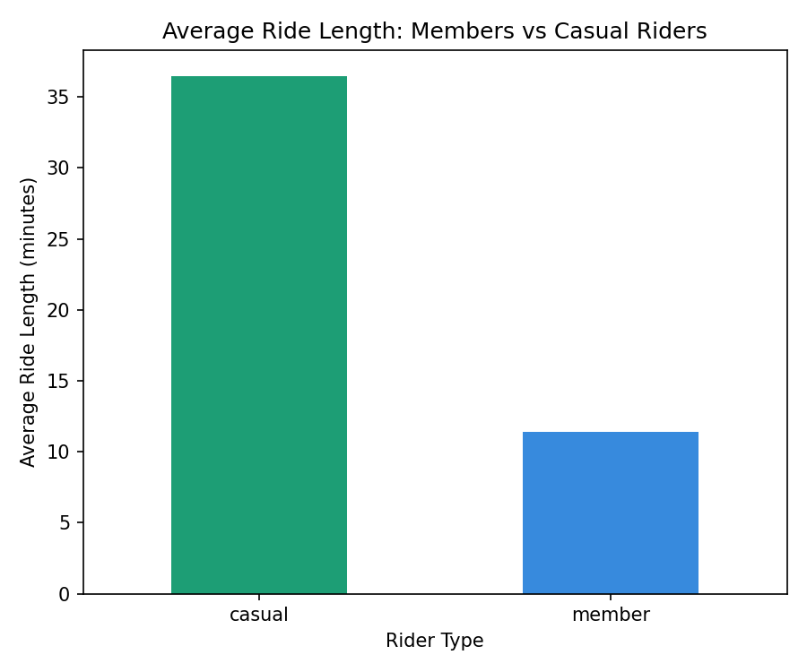
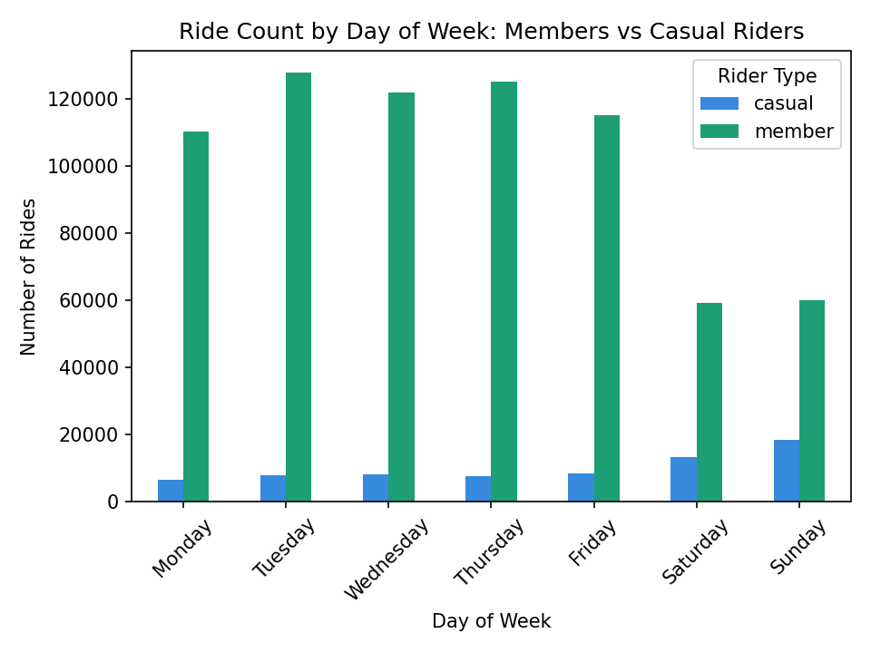

# Cyclistic Bike-Share Analysis

A data analytics case study examining how annual members and casual riders use a bike-share program differently, with the goal of informing a marketing strategy to convert casual riders into annual members.

## Business task

Cyclistic's marketing team wants to maximize annual memberships, since members are more profitable than casual riders. This analysis explores how members and casual riders use Cyclistic bikes differently, in order to inform a targeted marketing strategy.

## Data source

Historical trip data from Divvy (Chicago's bike-share system), covering Q1 2019 and Q1 2020. Data made publicly available by Motivate International Inc. under their [license](https://www.divvybikes.com/data-license-agreement).

## Process

- Combined two datasets with different schemas (2019 and 2020 used different column names and structures)
- Standardized column names and rider-type labels (`Subscriber`/`Customer` → `member`/`casual`)
- Removed invalid rides (negative durations, rides longer than 24 hours)
- Calculated `ride_length` and `day_of_week` for each ride

## Key findings

- **Casual riders take much longer rides on average** — 36.5 minutes vs. 11.4 minutes for members (over 3x longer)
- **Members ride heavily on weekdays**, consistent with commuting behavior, while **casual riders peak on weekends**, consistent with leisure use

## Recommendations

1. **Launch a weekend-focused membership tier or promotion** that emphasizes value for longer, leisurely rides rather than commuting savings
2. **Target casual riders with personalized cost-savings campaigns** based on their actual usage patterns
3. **Run a weekend-timed trial membership campaign**, since Sunday is casual riders' peak day, to let them experience membership benefits when they're most engaged

## Tools used

Python, pandas, matplotlib

## Author

Karen Letir · [GitHub](https://github.com/K-letir-rgb)
